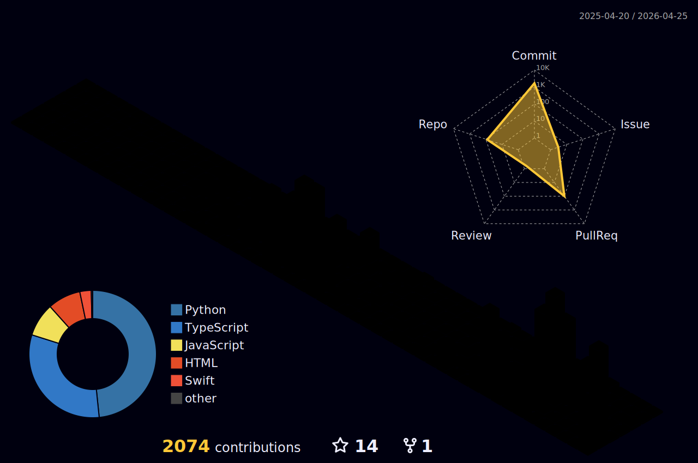

 

 

---

## About

I build production AI systems — distributed backends, agentic LLM pipelines, MCP servers, full-stack apps. Previously at **Amazon** (Seattle) building computer-vision models on 500K+ daily images and microservices serving 100K+ requests/second. Now Senior Software Engineer at **HHA Medicine** (Corpus Christi, TX) building RAG systems and GPT-4 clinical decision support across 15+ hospitals.

I treat side projects as production code — type checks, tests, infra, the lot. The portfolio is the running log.

---

## What I'm working on

<table>
<tr>
<td width="50%" valign="top">

### [Recruiter Agent](https://github.com/DandaAkhilReddy/recruiter_agent)

AI-powered talent scouting on Azure. Paste a JD, get a ranked candidate shortlist with **explainable Match & Interest scores**. Live recruiter ↔ candidate-persona conversations stream to the UI via SSE.

`Next.js 14` · `FastAPI` · `Postgres + pgvector` · `Azure OpenAI`

</td>
<td width="50%" valign="top">

### [Stock Analyzer](https://github.com/DandaAkhilReddy/Stock_analyzer)

Real-time market data + AI investment insights. Live quotes, candlestick charts, technical indicators (SMA / EMA / RSI / MACD / Bollinger), price predictions, news sentiment.

`React 19` · `FastAPI` · `Azure OpenAI` · `TradingView`

</td>
</tr>
<tr>
<td width="50%" valign="top">

### GSoC 2026 — InVesalius

Preparing a proposal for *"Saving Timestamp for Each Created Marker"* (90h) on the open-source medical imaging project.

`Python` · `wxPython` · `VTK`

</td>
<td width="50%" valign="top">

### Daily LLM Shipping

A new project most days: persistent LLM memory, on-device inference, agent orchestration, multi-agent hedge-fund sims.

`MCP` · `LangGraph` · `Azure OpenAI` · `Llama`

</td>
</tr>
</table>

---

## 3D Contribution Graph

  

---

## GitHub at a Glance

 

---

## Trophy Showcase

  

---

## Snake Eats My Contributions

  <picture>
    <source media="(prefers-color-scheme: dark)" srcset="https://raw.githubusercontent.com/DandaAkhilReddy/dandaakhilreddy/output/github-snake-dark.svg"/>
    <source media="(prefers-color-scheme: light)" srcset="https://raw.githubusercontent.com/DandaAkhilReddy/dandaakhilreddy/output/github-snake.svg"/>
    
  </picture>

---

## Contribution Activity

  

---

## Tech I Work With

**Languages**

**AI / Backend**

&nbsp;

**Frontend**

**Cloud & DevOps**

**Tools**

---

## Background

| Where | Role | Highlights |
|:------|:-----|:-----------|
| **HHA Medicine** | Senior Software Engineer Jan 2023 – Present · Corpus Christi, TX | RAG systems with 40% improved relevance · GPT-4 clinical support for 50K+ daily decisions · 100GB+ daily healthcare data |
| **Amazon** | Software Development Engineer Feb 2022 – Jan 2023 · Seattle, WA | CNN models on 500K+ daily images · 100K+ req/sec microservices · 65% latency reduction · 25% cost reduction |
| **Texas A&M University** | MS Computer Science | Graduate research in ML / systems |

---

## What I Love

- **Cricket** — competitive league play in San Antonio. Scored a century there. The single sport where strategy, patience, and craft all sit at the same table.
- **Building LLM systems** — fine-tuning, RAG pipelines, agent orchestration, prompt engineering. Anything where models actually do work, not just chat.
- **Quantum computing & research** — daily arXiv reader, following quantum hardware progress and post-quantum cryptography.

---

Open to senior backend / AI-ML / agent-infrastructure roles · Always up for a conversation on systems and language models.

  

<a href="mailto:akhilreddydanda3@gmail.com"><strong>akhilreddydanda3@gmail.com</strong></a>
&nbsp;·&nbsp;
<a href="https://www.linkedin.com/in/akhil-reddy-danda-1a74b214b/"><strong>LinkedIn</strong></a>
&nbsp;·&nbsp;
<a href="https://dandaakhilreddy.com"><strong>Portfolio</strong></a>

  

